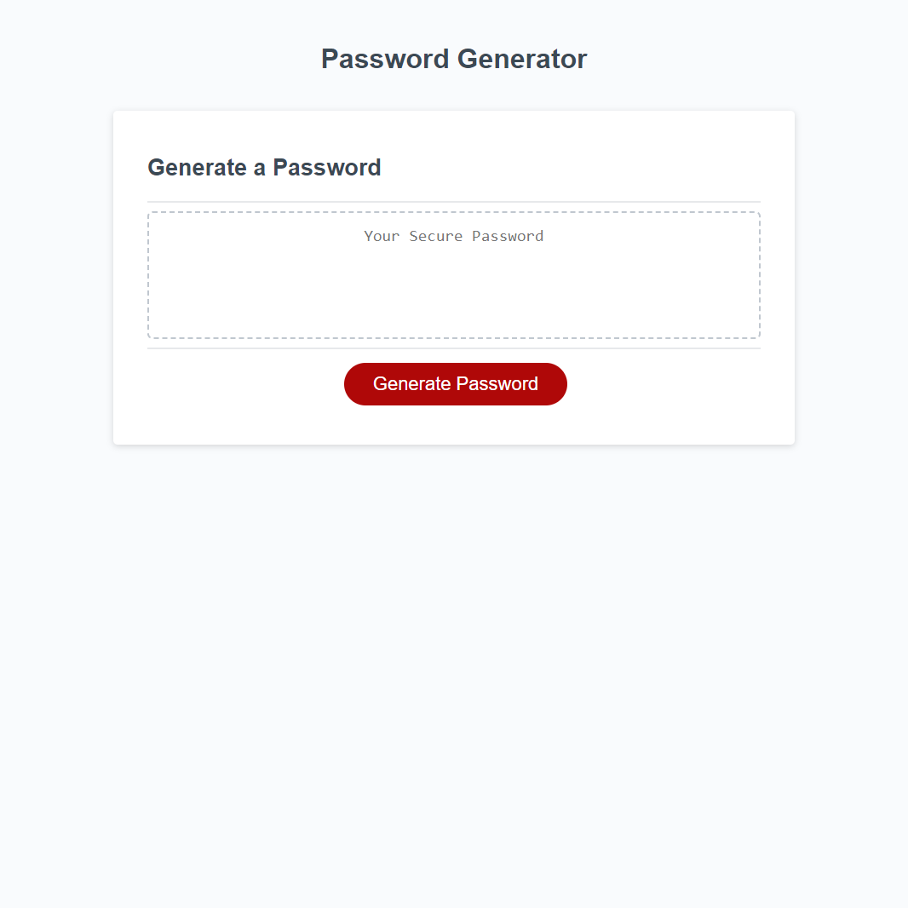

# Password Generator Tool

## Description

The motivation of this project was to create a tool to generate a password based off of a few different variables. I learned a lot about functions and how to write something with JavaScript. This solves the problem of not having a tool to generate passwords randomly.

## Installation

No installation required. Just visit the link to the deployed site [here](https://blaubachs.github.io/password-generator-tool/).

## Usage

To use this tool, click the "generate password" button, and follow the prompts on screen. It will then generate a password based off of the choices you make.

## License

No license.

---

## Features

This project features the ability to decide if you want a certain type of character or not in the password generated. It allows you to choose between uppercase, lowercase, numeric, and special characters, and then outputs a result in the text box when completed.
